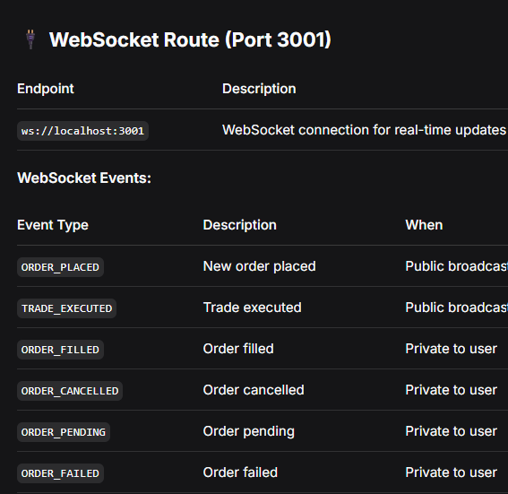

# Agent MD

# ARCHITECTURE RULES:
- Follow OOP strictly: use classes with clear responsibilities, inheritance where appropriate, encapsulation, and constructor-based dependency injection.
- Avoid procedural/functional business logic, static business methods, hard-coded dependencies, and circular dependencies.
- Follow SOLID:
  - SRP: one class = one responsibility.
  - OCP: extend through inheritance/new event types rather than modifying existing behavior.
  - LSP: implementations must respect interface contracts.
  - ISP: prefer small interfaces such as IOrderBook and IWallet.
  - DIP: depend on abstractions/interfaces, not concrete implementations.
- Use strict TypeScript types. Avoid `any` unless absolutely necessary.

# PROJECT STRUCTURE:
#backend/src/
├── domain/                    # Core business logic; no external dependencies
│   ├── engine/               # Trading engine
│   │   ├── services/         # Engine services
│   │   │   ├── Engine.ts
│   │   │   ├── orderBook/
│   │   │   └── wallet/
│   │   └── interface/        # Domain interfaces
│   └── events/               # Domain event system
├── http-layer/               # HTTP/API layer
│   ├── controllers/          # Request handlers
│   ├── dto/                  # Request/response DTOs
│   ├── routes/               # URL mappings
│   ├── service/              # Application orchestration
│   └── server.ts
├── infra/                    # Infrastructure
│   ├── logging/
│   ├── store/
│   └── ws/
├── shared/
└── tests/

# RESPONSIBILITY RULES:
- Business logic → domain/engine/
- Interfaces → domain/engine/interface/
- Events → domain/events/
- HTTP handlers → http-layer/controllers/
- DTOs → http-layer/dto/
- Routes → http-layer/routes/
- Application services → http-layer/service/
- Logger → infra/logging/
- Storage/repositories → infra/store/
- WebSockets → infra/ws/
- Tests → tests/ mirroring src structure.

# DESIGN PATTERNS:
1. Repository Pattern — abstracts data access; used by IOrderBook/IWallet and in-memory stores. Never bypass repositories.
2. Dependency Injection — inject dependencies through constructors; don't instantiate dependencies with `new` inside classes.
3. Event-Driven Architecture — Engine communicates cross-cutting concerns through EventBus/events rather than directly calling WebSocket or Logger.
4. Factory Pattern — LoggerFactory handles complex logger creation; don't overuse factories for simple objects.
5. Command Pattern — planned for future order/user commands.
6. Observer Pattern — EventManager/WebSocketBroadcaster subscribe to events and react to them instead of polling.

# CODING STANDARDS:
- Class order: private readonly dependencies → constructor/DI → public business methods → private helper methods.
- Import order: external packages → domain/interfaces → services → infrastructure → events.
- Use specific, contextual errors, e.g. include userId, required amount, and available balance.
- Use structured logging through Logger; don't use console.log in production.
- Avoid `any`, `var`, magic numbers, and missing error handling.

# TESTING:
- Every public method must have tests.
- Test private methods indirectly through public methods.
- Use Bun's built-in `describe`, `it`, `expect`, `beforeEach`, and `mock`.
- Follow Arrange → Act → Assert.
- Test names must clearly describe expected behavior.
- Use simple mocks; avoid unnecessarily complex manual mocks.
- Existing 51/51 tests must continue passing.
- Never remove existing tests or ignore failures.

# CRITICAL THINGS NOT TO CHANGE:
- Do not change the folder architecture or add/remove architecture layers without permission.
- Do not bypass dependency injection.
- Do not create circular dependencies.
- Do not remove `atomicMatch` from orderbook-store.ts because it prevents TOCTOU race conditions.
- Do not remove `tryLockFunds` from wallet-store.ts because it is an atomic balance/fund-locking operation.
- Do not break the matching loop.
- Do not remove Engine event emissions.
- Do not put WebSocket or Logger directly inside Engine; use events.
- Do not remove EventType enums or change event payload structures because they can break the UI.
- Do not remove subscribers without replacement.
- Preserve async event behavior where required.
- Do not break the 51/51 test suite.

# CORE DESIGN DECISIONS:
- Atomic Matching → orderbook-store.ts → prevents TOCTOU race conditions.
- Event-Driven Engine → StandardEngine.ts → keeps Engine decoupled from WebSocket/Logging.
- Dependency Injection → all constructors → improves testing and flexibility.
- Repository Pattern → IOrderBook/IWallet → abstracts data access.
- Batch Settlements → processOrder() → reduces database calls.
- Separate DTOs → http-layer/dto/ → keeps API models separate from domain models.
- LoggerFactory → infra/logging/ → centralized logging control.

# KEY FILE RESPONSIBILITIES:
- Engine.ts → order matching and trade execution; preserve matching logic and event emissions.
- orderbook-store.ts → order storage and atomic matching; preserve `atomicMatch`.
- wallet-store.ts → balance management; preserve `tryLockFunds`.
- event-bus.ts → event distribution through publish/subscribe.
- OrderController.ts → HTTP request handling, DTO validation, and error responses.
- order-service.ts → application orchestration/service-layer separation.
- ws-server.ts → WebSocket server and broadcasting/sendToUser behavior.
- Logger.ts → structured logging and log format.

# BEFORE MAKING ANY CHANGE:
1. Read and understand the architecture/agent instructions.
2. Understand the full existing context.
3. Verify that the change is actually necessary.
4. Consider downstream effects.
5. Follow existing architectural patterns.
6. Implement using OOP + SOLID + DI.
7. Add tests for every new/changed public method.
8. Maintain strict typing, structured logging, and proper error handling.
9. Ensure the complete 51/51 test suite still passes.

# CORE PRINCIPLE:
Keep the domain/business logic isolated, use interfaces and dependency injection for flexibility, communicate cross-cutting behavior through events, abstract storage through repositories, keep HTTP/WebSocket/infrastructure concerns outside the engine, and never sacrifice atomicity or existing test coverage for convenience.

# HTTP Routes (Port 3000)

Method  	Endpoint  	
GET	  /api/health	    
POST	  /api/orders	  
POST	/api/orders/add	
DELETE	/api/orders	
GET	/api/balance/:userId	
GET	/api/orderbook	Get 

# WS Routes

